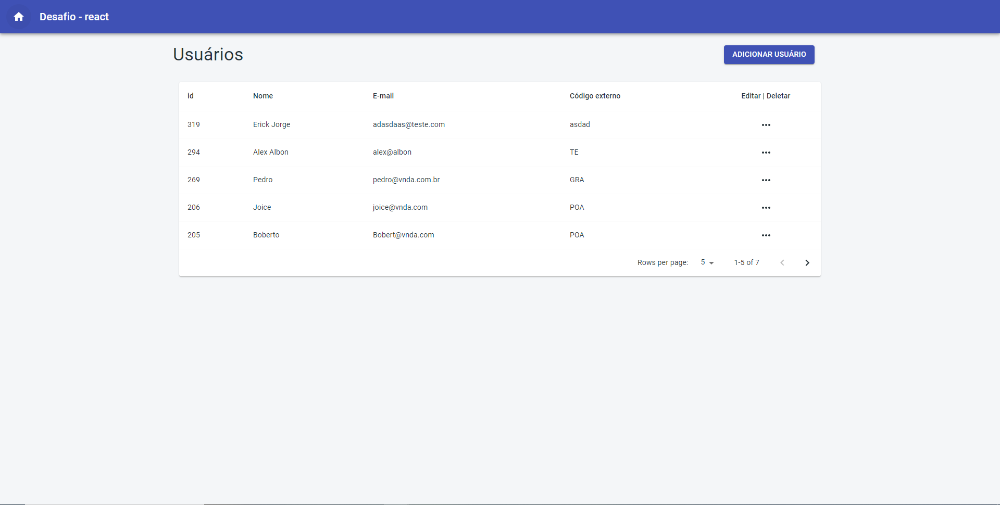
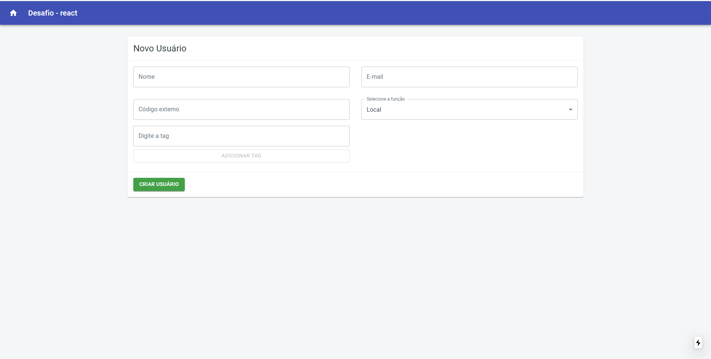
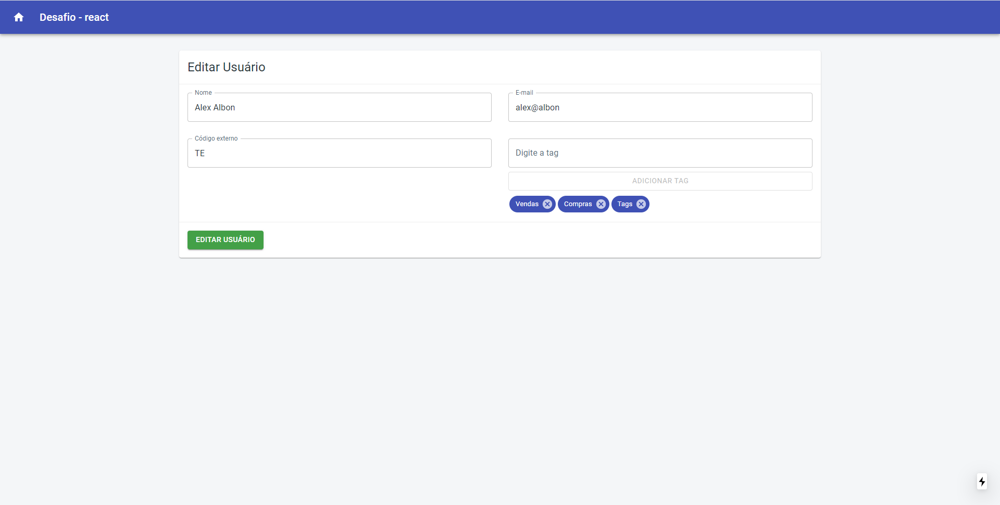
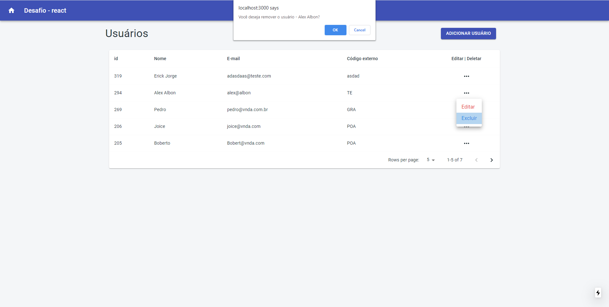

<h4 align="center">
	💻 Desáfio - Vnda
</h4>

<p align="center">
 <a href="#-sobre-o-projeto">Sobre</a> •
 <a href="#user-content-️-funcionalidades">Funcionalidades</a> •
 <a href="#-layout">Layout</a> •
 <a href="#-como-executar-o-projeto">Como executar</a> •
 <a href="#-tecnologias">Tecnologias</a> •
 <a href="#-autor">Autore</a> •
 <a href="#user-content--licença">Licença</a> •

</p>

## 💻 Sobre o projeto

Esse projeto faz parte de um processo seletivo da empresa Vnda, que consiste na criação de um CRUD de usuários utilizando a API da empresa.

## ⚙️ Funcionalidades

- [x] Tela listar usuários
- [x] Tela editar usuário
- [x] Tela criar usuário

---

## 🎨 Layout

O layout da aplicação.

### Frontend

<p align="center">
  

  

  

  
</p>

---

## 🚀 Como executar o projeto

### Pré-requisitos

Antes de começar, você vai precisar ter instalado em sua máquina as seguintes ferramentas:
[Git](https://git-scm.com), [Node.js](https://nodejs.org/en/).
Além disto é bom ter um editor para trabalhar com o código como [VSCode](https://code.visualstudio.com/)

#### 🧭 Rodando a aplicação

```bash

# Clone este repositório
$ git clone git@github.com:geanfeltrin/Desafio-Vnda.git

# Acesse a pasta do projeto no seu terminal/cmd
$ cd desafio-vnda

# Na raiz do projeto crie um arquivo .env.local como o .env.exemple e adicione seu Token
$ touch .env.local

# Instale as dependências
$ yarn install

# Gere o build
$ yarn build

# Execute a aplicação em modo de desenvolvimento
$ yarn start

# A aplicação será aberta na porta:3000 - acesse http://localhost:3000

```

---

## 🛠 Tecnologias

As seguintes ferramentas foram usadas na construção do projeto:

#### **Frontend** ([NextJs])(https://nextjs.org/)

- **[ReactJs](https://reactjs.org/)**
- **[Material-UI](https://material-ui.com/)**
- **[Axios](https://github.com/axios/axios)**
- **[NextJs](https://nextjs.org/)**
- **[Typescript](https://www.typescriptlang.org/)**

## 🦸 Autor

<a href="https://github.com/geanfeltrin">
 
 <br />
  <sub>
    <b>Gean Feltrin - Web Developer</b>
  </sub>
</a>
 <br />

[](https://twitter.com/Geanfeltrin1) [](https://www.linkedin.com/in/geanfeltrin/)
[](mailto:geanfeltrin75@gmail.com)

---

## 📝 Licença

Este projeto esta sobe a licença [MIT](./LICENSE).

Feito com ❤️ por Gean Feltrin 👋🏽 [Entre em contato!](https://www.linkedin.com/in/geanfeltrin/)

---
